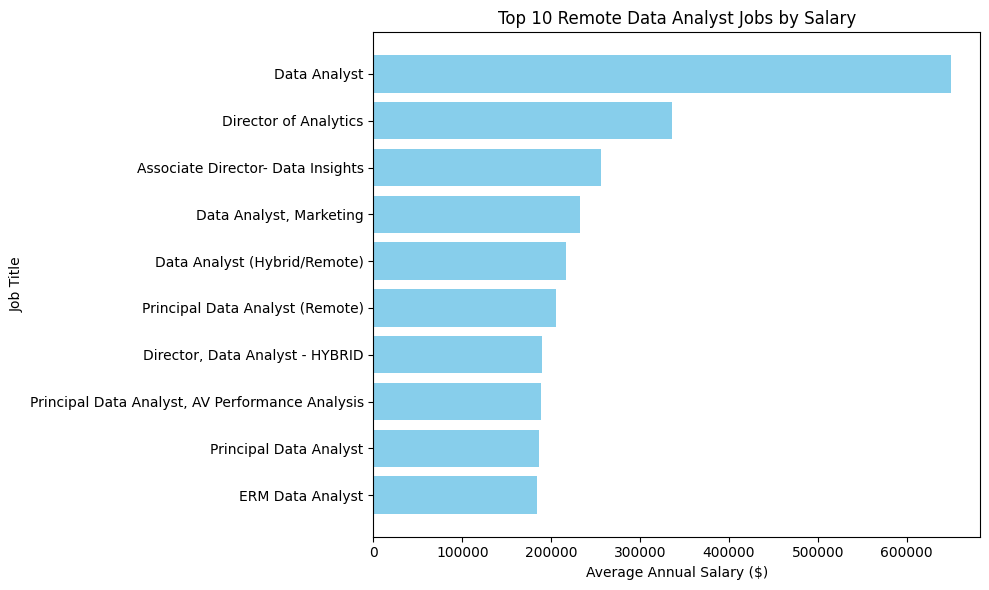
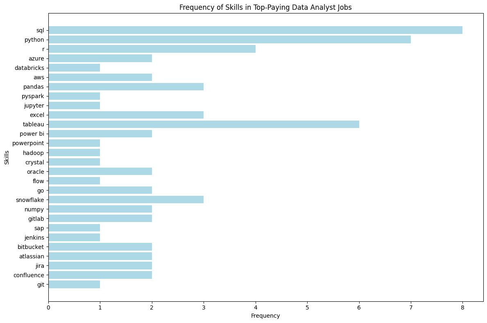

# Introduction

Let's explore the top paying skills  and identify the most in demand skills in data analytics. 

Project Queries : [project_sql folder](/project_sql/)

Csv_files: https://drive.google.com/drive/folders/1jEtexI9VITJjyKC7OKywZf1JtZyE8WJd?usp=drive_link

# Background

This project was inspired by both my interest in SQL and to practice my skills in SQL and the curiosity to explore and pinpoint the most in-demand skills in data analytics.

N.B: This project can be easily altered to explore other data roles such as data scientits, data engineers, and data analysts.

### The Questions i wanted to answer were:

1. What are thr top paying data analyst jobs ?
2. What skills are required for these top paying jobs ?
3. What skills are the most in demand for data analysts ?
4. Which skills are associated with the highest salaries ?
5. What are the most optimal skills to learn ?

# Tools Used

- **SQL** : Queries that allowed me to extract and analyze the data.
- **PostgreSQL** : Database used to store and manage the data.
- **Visual Studio Code** : Editor used to write and run the SQL queries.
- **Python** : Programming language used to generate the graphs and tables.
- **notebooks** : Jupyter notebooks used to create the graphs and tables.
- **Git and Github** : For Version control and sharing of my project ensuring proper tracking.

# The Analysis

## 1. What are the top paying data analyst jobs ?
- I am going to identify the highest-paying data analyst roles that are available remotely.
- Focus on job postings with specified salaries 
- **Value** : Offer insights for job hunting
````	sql
SELECT
    job_id,
    job_title,
    company_dim.name AS company_name,
    job_location,
    job_schedule_type,
    salary_year_avg,
    job_posted_date::DATE
FROM 
    job_postings_fact
LEFT JOIN
    company_dim
    ON job_postings_fact.company_id = company_dim.company_id
WHERE
    job_title_short = 'Data Analyst' AND
    job_location = 'Anywhere' AND  -- or job_work_from_home = TRUEA
    salary_year_avg IS NOT NULL
ORDER BY
    salary_year_avg DESC
LIMIT 10

````
### Analysis:
 - **Wide Salary Range**: The top 10 jobs have a wide range of salaries, from $184,000 to $650,000.
-   **Diverse Titles and Roles**
- Roles like "Director of Analytics" and "Associate Director- Data Insights" indicate a leadership/strategic focus in analytics jobs that significantly boost salaries.
- Specialized roles like "Data Analyst, Marketing" or "Principal Data Analyst, AV Performance Analysis" show that domain-specific expertise can also command high pay.
- **Consistency**: The top 10 jobs are all full time.



*The graph was generated in using python based on the results of the SQL query.*
- Query results here : [query_1_results.csv](/results/1_top_paying_jobs.csv) 
- Python code here : [Python Notebook](/plotting_notebook/results_plotting.ipynb)


## 2. What skills are required for these top paying jobs ?
- I am going to identify the specific skills required for these roles.
- **Value** : provides detailed look at what skills are demanded for high paying jobs,
    which can be helpful for job seekers.

````	sql
WITH top_paying_jobs AS (
    
    SELECT
        job_id,
        job_title,
        company_dim.name AS company_name,
        salary_year_avg
    FROM 
        job_postings_fact
    LEFT JOIN
        company_dim
        ON job_postings_fact.company_id = company_dim.company_id
    WHERE
        job_title_short = 'Data Analyst' AND
        job_location = 'Anywhere' AND  -- or job_work_from_home = TRUE
        salary_year_avg IS NOT NULL
    ORDER BY
        salary_year_avg DESC
    LIMIT 10
)

SELECT top_paying_jobs.* ,
    skills
FROM 
    top_paying_jobs
INNER JOIN skills_job_dim ON top_paying_jobs.job_id = skills_job_dim.job_id
INNER JOIN skills_dim ON skills_job_dim.skill_id = skills_dim.skill_id
ORDER BY
    salary_year_avg DESC

````

### Analysis:

- **SQL** is leading with a bold count of 8.
- **Python** follows closely with a bold count of 7.
- **Tableau** is also highly sought after, with a bold count of 6.



*The graph was generated in using python based on the results of the SQL query.*
- Query results here : [query_2_results.csv](results/2_top_paying_jobs_skills.csv) 
- Python code here : [Python Notebook](/plotting_notebook/results_plotting.ipynb)


## 3. What skills are the most in demand for data analysts ?
- I am going to identify the most in demand skills for data analysts.
- **Value** : provides insights into the most sought-after skills for data analysts.

````	sql
SELECT 
    skills_dim.skills as skill,
    COUNT(skills_job_dim.job_id) AS demand_count
FROM job_postings_fact 
    INNER JOIN skills_job_dim ON job_postings_fact.job_id = skills_job_dim.job_id
    INNER JOIN skills_dim ON skills_job_dim.skill_id = skills_dim.skill_id
WHERE 
    job_title_short = 'Data Analyst'
GROUP BY  
    skill
ORDER BY 
    demand_count DESC
LIMIT 5

````
| Rank | Skill       | Demand Count |
|------|-------------|--------------|
| 1    | SQL         | 7,291        |
| 2    | Excel       | 4,611        |
| 3    | Python      | 4,330        |
| 4    | Tableau     | 3,745        |
| 5    | Power BI    | 2,609        |
| 6    | R           | 2,142        |
| 7    | SAS         | 1,866        |
| 8    | Looker      | 868          |
| 9    | Azure       | 821          |
| 10   | PowerPoint  | 819          |

Results here : [query_3_results.csv](results/3_top_demanded_skills.csv)

### Analysis:

- **SQL** remains the most in-demand skill for data analysts, indispensable across industries.
- **Excel**  Excel is still widely used for data manipulation, reporting, and quick analysis.
- **Python's** versatility in data cleaning, analysis, and machine learning ensures it remains a key skill.
- **Tableau's** interface for data visualization.
- **Power BI's** ability to connect to multiple data sources and create interactive dashboards for data analysis.


## 4. Which skills are associated with the highest salaries ?
- I am going to identify the skills associated with the highest salaries for data analysts.
- **Value** : provides insights into the skills associated with the highest salaries for data analysts.

````	sql
SELECT 
    skills_dim.skills,
    ROUND(AVG(salary_year_avg), 0) AS avg_salary
FROM job_postings_fact
    INNER JOIN skills_job_dim ON job_postings_fact.job_id = skills_job_dim.job_id
    INNER JOIN skills_dim ON skills_job_dim.skill_id = skills_dim.skill_id
WHERE 
    job_title_short = 'Data Analyst' AND salary_year_avg IS NOT NULL
GROUP BY
    skills_dim.skills
ORDER BY
    avg_salary DESC
LIMIT 10

````

| Rank | Skill          | Average Salary ($) |
|------|----------------|---------------------|
| 1    | PySpark        | 208,172            |
| 2    | Bitbucket      | 189,155            |
| 3    | Watson         | 160,515            |
| 4    | Couchbase      | 160,515            |
| 5    | DataRobot      | 155,486            |
| 6    | GitLab         | 154,500            |
| 7    | Swift          | 153,750            |
| 8    | Jupyter        | 152,777            |
| 9    | Pandas         | 151,821            |
| 10   | Elasticsearch  | 145,000            |

*Average Salary for the TOP 10 paying skills for data analysts*

Results here : [query_4_results.csv](results/4_top_paying_skills.csv)

### Analysis:
1. **PySpark** leads the list, highlighting its importance in big data processing and analysis.
2. **Bitbucket** and **GitLab** emphasize the demand for version control and collaboration tools in data workflows.
3. **Watson** and **DataRobot** reflect the growing value of AI and automated machine learning platforms in high-paying roles.
4. **Jupyter** and **Pandas** are widely used tools in the Python ecosystem, indicating their significance for high-earning analysts.
5. **Elasticsearch** and **Couchbase** underscore the need for expertise in database management and search technologies.

## 5. What are the most optimal skills to learn ?
- I am going to identify the most optimal skills to learn for data analysts.
- **Value** : provides insights into the most optimal skills to learn for data analysts.

````	sql
-- CTE METHOD
WITH skills_demand AS (

    SELECT 
        skills_dim.skill_id as skill_id,
        skills_dim.skills as skill,
        COUNT(skills_job_dim.job_id) AS demand_count
    FROM job_postings_fact 
        INNER JOIN skills_job_dim ON job_postings_fact.job_id = skills_job_dim.job_id
        INNER JOIN skills_dim ON skills_job_dim.skill_id = skills_dim.skill_id
    WHERE 
        job_title_short = 'Data Analyst' 
        AND salary_year_avg IS NOT NULL
        AND job_work_from_home = TRUE
    GROUP BY  
        skills_dim.skill_id
), average_salary AS (
    SELECT
        skills_job_dim.skill_id as skill_id,
        ROUND(AVG(salary_year_avg), 0) AS avg_salary
    FROM job_postings_fact
        INNER JOIN skills_job_dim ON job_postings_fact.job_id = skills_job_dim.job_id
        INNER JOIN skills_dim ON skills_job_dim.skill_id = skills_dim.skill_id
    WHERE 
        job_title_short = 'Data Analyst' 
        AND salary_year_avg IS NOT NULL
        AND job_work_from_home = TRUE
    GROUP BY
        skills_job_dim.skill_id
)

SELECT 
    skills_demand.skill_id,
    skills_demand.skill,
    demand_count,
    avg_salary
FROM skills_demand
INNER JOIN average_salary ON skills_demand.skill_id = average_salary.skill_id
WHERE demand_count > 10
ORDER BY 
    avg_salary DESC,
    demand_count DESC

LIMIT 25

-- more concise solution
SELECT
    skills_dim.skill_id,
    skills_dim.skills,
    COUNT(skills_job_dim.job_id) AS demand_count,
    ROUND(AVG(salary_year_avg), 0) AS avg_salary
FROM job_postings_fact 
    INNER JOIN skills_job_dim ON job_postings_fact.job_id = skills_job_dim.job_id
    INNER JOIN skills_dim ON skills_job_dim.skill_id = skills_dim.skill_id
WHERE 
    job_title_short = 'Data Analyst' 
    AND salary_year_avg IS NOT NULL
    AND job_work_from_home = TRUE
GROUP BY  
    skills_dim.skill_id
HAVING
    -- demand count (putting the aggregation itself in the having clause can't be done
    -- and therefore we have rewrite the demand_count aggregation again here )
    COUNT(skills_job_dim.job_id) > 10
ORDER BY 
    avg_salary DESC,
    demand_count DESC
LIMIT 25;

````
Notes :
* If we order it by avg_salary and then demand count 
we can see higher salaries tha are above 120k 
but the demand count is very very low for these skills
( between 1 and 10) for the top 25.

* If we order it by demand_count and then average salary the salaries are between
81k and 115k but here the demand count is between (18 and 398) which is decent and might 
give us another perspective on the skills and their demand and therefore might
encourage job seekers to seek these skills that are decently paid but not the top paid 
due to their higher demand.

* Another alternative is to order by average salary and then demand count but put
a constraint of demand count being higher than 10.
that gave me better results of salaries between 97k and 115k and jobs with demand count
between 11 and 236 which can be a more balanced compromise between the highest paid skills
and the most in-demand skills.

| Rank | Skill          | Demand Count | Average Salary ($) |
|------|----------------|--------------|---------------------|
| 1    | Go             | 27           | 115,320            |
| 2    | Confluence     | 11           | 114,210            |
| 3    | Hadoop         | 22           | 113,193            |
| 4    | Snowflake      | 37           | 112,948            |
| 5    | Azure          | 34           | 111,225            |
| 6    | BigQuery       | 13           | 109,654            |
| 7    | AWS            | 32           | 108,317            |
| 8    | Java           | 17           | 106,906            |
| 9    | SSIS           | 12           | 106,683            |
| 10   | JIRA           | 20           | 104,918            |
| 11   | Oracle         | 37           | 104,534            |
| 12   | Looker         | 49           | 103,795            |
| 13   | NoSQL          | 13           | 101,414            |
| 14   | Python         | 236          | 101,397            |
| 15   | R              | 148          | 100,499            |
| 16   | Redshift       | 16           | 99,936             |
| 17   | Qlik           | 13           | 99,631             |
| 18   | Tableau        | 230          | 99,288             |
| 19   | SSRS           | 14           | 99,171             |
| 20   | Spark          | 13           | 99,077             |
| 21   | C++            | 11           | 98,958             |
| 22   | SAS            | 63           | 98,902             |
| 23   | SQL Server     | 35           | 97,786             |
| 24   | JavaScript     | 20           | 97,587             |

Results here : [query_5_results.csv](results/5_most_optimal_skills.csv)

### Analysis:
- **High-Demand Programming Languages**: Python and R are in high demand, with 236 and 148 mentions respectively. While their average salaries are $101,397 for Python and $100,499 for R, this suggests their value is widely recognized, though they are also commonly available skills.

- **Cloud Tools and Technologies**: Specialized skills in tools like Snowflake, Azure, AWS, and BigQuery are in demand and command competitive average salaries. This reflects the growing reliance on cloud platforms and big data technologies in modern data analysis.

- **Business Intelligence and Visualization Tools**: Tableau and Looker demonstrate their importance in deriving actionable insights, with demand counts of 230 and 49 and average salaries of $99,288 and $103,795, respectively.

- **Database Technologies**: Expertise in both traditional and NoSQL databases, such as Oracle, SQL Server, and NoSQL, remains essential. These skills offer average salaries between $97,786 and $104,534, emphasizing their enduring relevance for data storage, retrieval, and management.

# Conclusions

- **Skills for Top-Paying Jobs**: To land high-paying data analyst roles, advanced proficiency in SQL is essential. It's a foundational skill that consistently leads to higher earnings.

- **Most In-Demand Skills**: SQL stands out as the most sought-after skill in the data analyst job market, making it a must-have for anyone looking to secure a role in the field.

- **Skills with Higher Salaries**: Specialized skills like SVN and Solidity command some of the highest salaries, showing that niche expertise can significantly boost earning potential.

- **Optimal Skills for Market Value**: SQL not only leads in demand but also offers competitive salaries, making it one of the best skills to focus on for maximizing career opportunities and market value as a data analyst.
